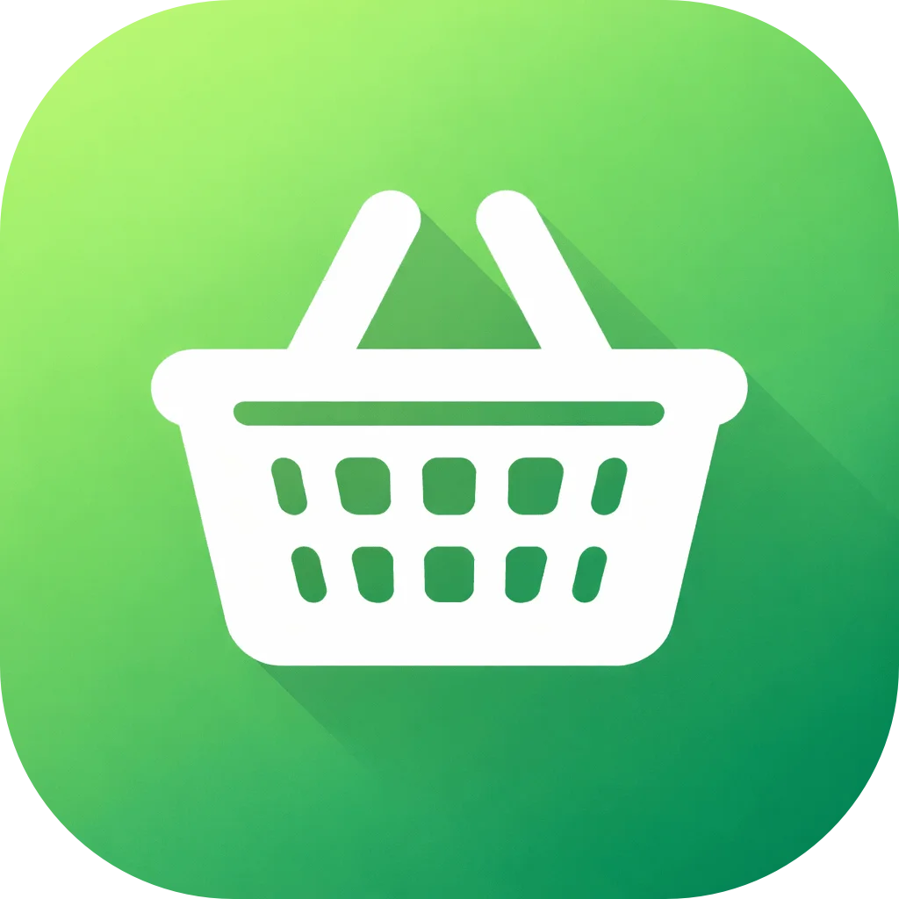
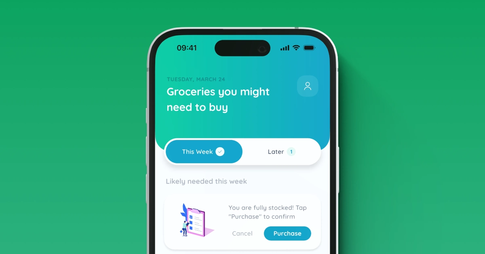
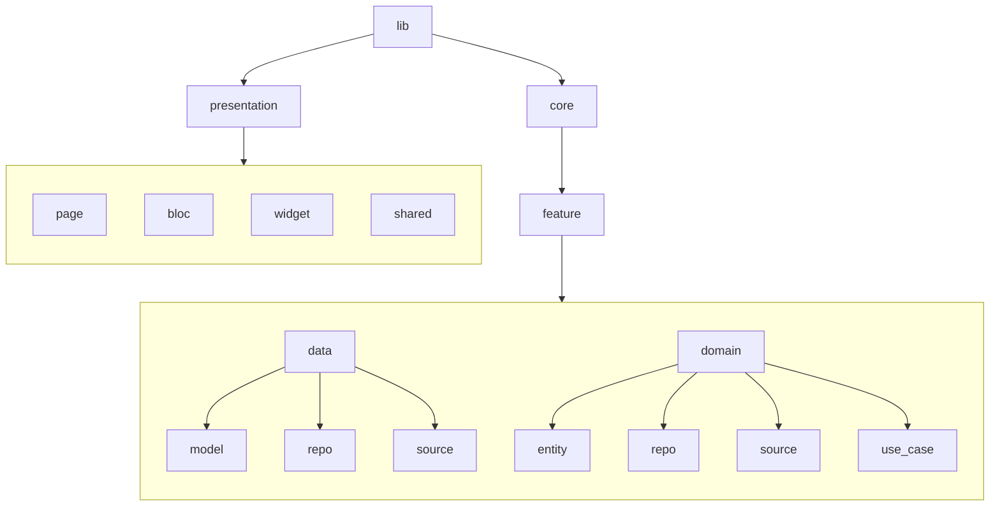

<h1 align="center">
  <br>
  <a href="https://www.denwee.com/listox">
    
  </a>
  <br>
  Listox: Smart Grocery List
  <br>
</h1>

<h4 align="center">Your smart grocery list that learns what you buy and reminds you when to restock!</h4>

<p align="center">
  <a href="https://apps.apple.com/app/listox-smart-grocery-list/id6760868986">
    
  </a>
  <a href="">
    
  </a>
</p>


<p align="center">
  <a href="https://www.denwee.com/app/listox">
    
  </a>
</p>


> Listox is an open-source mobile application built with Flutter. It helps you manage your groceries with smart predictions based on your shopping habits, supporting quick item tracking, automatic restock suggestions, and a scalable, modular architecture inspired by SOLID principles.


## 🛠 Tech Stack

| Layer      | Technologies | Description |
|----------- |--------------|-------------|
| **Frontend (Open Source)** | Flutter, Dart, Local Database, Localizations | Client app responsible for UI, grocery tracking, predictions display, and user interactions |
| **Backend / Services** | Firebase Analytics, Crashlytics, RevenueCat | Handles app analytics, crash reporting, and subscription management |
| **Infrastructure** | Apple In-App Purchases, Firebase Services | Manages payments, subscriptions, analytics, and app stability |


## 📦 Primary Packages

| Package | Purpose |
|---------|---------|
| [flutter_bloc](https://pub.dev/packages/flutter_bloc) | State management |
| [get_it](https://pub.dev/packages/get_it) | Dependency injection |
| [app_links](https://pub.dev/packages/app_links) | Deep links |
| [drift](https://pub.dev/packages/drift) | Local database |
| [dio](https://pub.dev/packages/dio) | Network requests |
| [easy_localization](https://pub.dev/packages/easy_localization) | Multi-language support |
| [animate_do](https://pub.dev/packages/animate_do) | Animations |


## 🧩 Architecture

> This section describes the architectural structure of the application and its internal dependency model.
> The design follows principles inspired by Clean Architecture, with emphasis on separation of concerns, modularity, and long-term maintainability.


### Folder Structure

The project is organized using a feature-based structure with explicit separation between domain, data, and presentation layers.
The following diagram illustrates the base structure of the project:



> The `presentation/` folder is kept outside of the `core/` directory to enforce strict separation between application logic and UI components.
> Below is what each layer is responsible for using the **Profile** feature as an example for typical files ⬇️


### Domain Layer

| Folder      | Responsibility | Typical Files |
|-------------|----------------|---------------|
| `entity/`   | Business models | `profile.dart`<br>`profile_failure.dart` |
| `use_case/` | Business operations | `get_profile_use_case.dart` |
| `repo/`     | Repository contracts | `profile_repo.dart` |
| `source/`   | Data source contracts | `profile_local_source.dart`<br>`profile_remote_source.dart` |

> The domain layer contains pure business logic and application rules for implementing feature behavior in the application.
> It defines core use cases and entities and remains independent of external frameworks and data sources.


### Data Layer

| Folder     | Responsibility | Typical Files |
|------------|----------------|---------------|
| `model/`   | Data transfer objects (DTOs) | `profile_dto.dart`<br>`profile_response_dto.dart` |
| `repo/`    | Repository implementations | `profile_repo_impl.dart` |
| `source/`  | Local / Remote data source implementations | `profile_local_source_impl.dart`<br>`profile_remote_source_impl.dart` |

> The data layer is used for retrieving, storing, and transforming external data for application features.
> It implements domain contracts and performs DTO-to-entity mapping.


### Presentation Layer

- `pages/` contains all application screens
- `bloc/` contains Cubits and Blocs for state management
- `widget/` contains reusable UI components
- `shared/` contains routing, theming, constants, utilities, etc...

> The presentation layer is separated from core feature modules as a deliberate design choice.
> This structure reflects a personal preference for improved screen discoverability and centralized UI infrastructure.


### Dependency Injection

The application uses annotation-based dependency injection with `injectable` and `get_it` to connect layers and enable controlled execution flows.
Dependencies are registered automatically through code generation.

Example objects injection:
``` dart
@LazySingleton()
class ProfileCubit extends Cubit<ProfileState> {
  final GetProfileUseCase _getProfileUseCase;

  ProfileCubit(this._getProfileUseCase) : super(ProfileState.initial());
}

@LazySingleton()
class GetProfileUseCase {
  final ProfileRepo _profileRepo;

  const GetProfileUseCase(this._profileRepo);
}
```

Example resolution hierarchy:

```text
ProfilePage
  → ProfileCubit
    → GetProfileUseCase
      → ProfileRepository
        → ProfileRemoteSource / ProfileLocalSource
          → API
```


## 🖌️ Assets

- **Static icons** from [Iconsax](https://iconsax.io)
- **Animated emojis** from [Noto Animated Emojis](https://googlefonts.github.io/noto-emoji-animation/) — licensed under [CC BY 4.0](https://creativecommons.org/licenses/by/4.0/legalcode)  
- **Fonts:** [Quicksand](https://fonts.google.com/specimen/Quicksand) (Primary), [Manrope](https://fonts.google.com/specimen/Manrope) (Secondary)


## 🚀 How To Run

To run this application, you'll need [Flutter](https://flutter.dev) of version `3.38.1` or higher:

```bash
# Get all packages
flutter pub get

# Generate localization files
flutter pub run easy_localization:generate -S "assets/translations" -O "lib/presentation/shared/localization"

# Generate localization keys
flutter pub run easy_localization:generate -S "assets/translations" -O "lib/presentation/shared/localization" -o "locale_keys.g.dart" -f keys

# Build runner
dart run build_runner build --delete-conflicting-outputs

# Run dev environment
flutter run --flavor dev -t lib/main_dev.dart

# Run prod environment
flutter run --flavor prod -t lib/main_prod.dart
```


## 🤝 How To Contribute

Denwee projects are crafted by a solo enthusiastic developer across Mobile, Web, and Backend technologies. Your contributions, no matter how big or small, are always welcome! Here’s how you can help:

* **Open PR's** – fix bugs, add features, or improve existing code.
* **Submit Issues** – report bugs, request features, or suggest improvements.


## 🌐 You May Also Like

Explore the **Denwee App**, built with Flutter. The app has scalable architecture which you can follow in your projects 🔥 [Check it out](https://github.com/denweeLabs/factlyapp)


## 🏆 Credits

Some design elements and animations were inspired by [Reflectly App](https://reflectlyapp.com), adapted and implemented originally for Denwee. Definitely check out their awesome product!


## ❤️ Support

If this project helped you, a quick review on the App Store or Google Play would really mean a lot!
For any questions or support, please reach out to support@denwee.com 🫶

<a href="https://buymeacoffee.com/denweelabs" target="_blank"></a>


## 📃 License

[](https://opensource.org/licenses/MIT)
